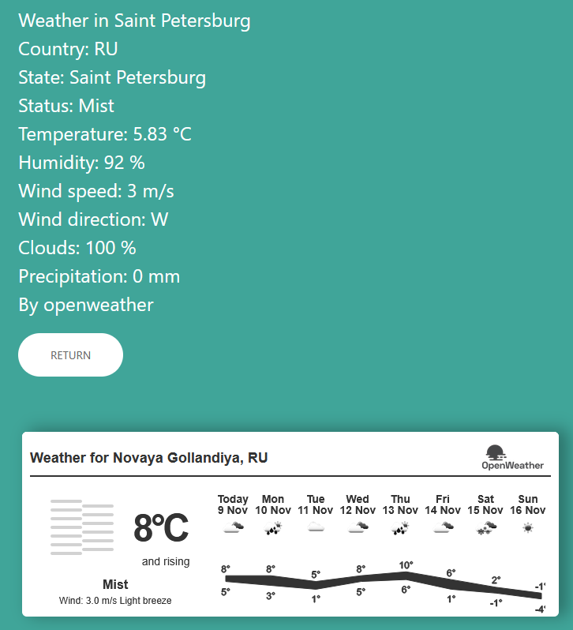

### [Readme_EN](README_EN.md)

# PoGoDnIk
## Soft for pogoda
## Особенности
___
#### - Погода по выбранному городу/списку городов
#### - Вывод в консоль или веб-интерфейс (Flask)
#### - Запись в базу данных (Sqlite3)
#### - Запись в CSV-файл
#### - Провайдеры:
##### [Open Weather](https://openweathermap.org)
##### [Open Meteo](https://open-meteo.com) (Только погода)

## Установка
___
### **Подготовка**

Для работы приложения рекомендуется Python 3.13

Инструкция для Windows 10 

Скачайте репозиторий
```
git clone https://github.com/Idvon/Pogodnik.git
```
### **Создание окружения**

В CMD перейдите в директорию с репозиторием и выполните команду
```commandline
virtualenv virtualenv_name
```
Запустите окружение
```commandline
virtualenv_name\Scripts\activate
```
Выполните установку пакетов
```
poetry install
```
### **Настройка config-файла**

Поддерживаемые форматы

[Пример JSON](example_config.json)

[Пример TOML](example_config.toml)

Структура config-файла

- `city_name`: Название вашего города на латинице или список городов
- `timeout`: Время кеширования погоды города в минутах  
- `weather_provider`: Параметры провайдера погоды  
  - `name`: Название  
  - `api_key`: API-ключ указанного провайдера  
- `geo_provider`: Параметры провайдера геопозиции   
  - `name`: Название  
  - `limit`: Кол-во отображаемых вариантов найденого города (Только для веб-интерфейса, по умолчанию 5)  
  - `api_key`: API-ключ указанного провайдера

Для работы Flask файл должен иметь название "config.json"

## **Запуск**  
___

Команды вводятся в CMD, в запущенном окружении

Вывод в консоль
```
python PoGoDnIk.py --config config.json --output out.csv
```
Пример вывода
```
Weather in Saint Petersburg
Country: RU
State: Saint Petersburg
Status: Clouds
Temperature: 3.41 °C
Humidity: 91 %
Wind speed: 5 m/s
Wind direction: SE
Clouds: 75 %
Precipitation: 0 mm
By openweather
```
Использование веб-интерфейса
```
flask run
```
Расположен по адресу: http://127.0.0.1:5000/

Окно ввода города:


Выбор города из списка найденых (от 1 до 5):


Страница погоды (виджет доступен у провайдера OpenWeather):



### **База данных**

Каждый релевантный результат записывается в `db.sqlite3` и файл вывода `out.csv` когда `timeout` > время с прошлого запроса

В ином случае данные берутся из кэша базы данных

## **Дорожная карта**
___

- [x] Альтернативный источник погоды
- [x] База данных
- [x] Кеширование
- [x] Веб-интерфейс
- [x] Вывод прогноза погоды на весь день, неделю (Только OpenWeather)
- [ ] Docker контейнер