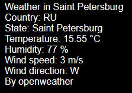

# PoGoDnIk
## Soft for pogoda
### Особенности:
#### - Погода по выбранному городу
#### - Вывод в консоль или веб-интерфейс
#### - Вывод в базу данных (Sqlite3)
#### - Вывод в CSV-файл
#### - Протестирована работоспособность на API погоды:
##### [Open Weather](https://openweathermap.org)
##### [Open Meteo](https://open-meteo.com)

---
### Установка
**1. Создание окружения**
```
poetry install
```
**2. Создание config-файла**  
Примеры в репозитории  

Поддерживаемые форматы:
- JSON
- TOML

Структура:

city_name: Название вашего города на латинице  
timeout: Время кеширования погоды города в минутах  
weather_provider: Параметры провайдера погоды  
name: Название  
api_key: API-ключ указанного провайдера  
geo_provider: Параметры провайдера геопозиции   
name: Название  
limit: Кол-во отображаемых вариантов найденого города  
Только для веб-интерфейса, по умолчанию 5  
api_key: API-ключ указанного провайдера  
Файл должен иметь название "config"

**3. Запуск**  

Вывод в консоль:
```
python PoGoDnIk.py --config config.json --output out.csv
```
Пример вывода:
```
Weather in Saint Petersburg
Country: RU
State: Saint Petersburg
Temperature: 15.55 °C
Humidity: 76 %
Wind speed: 3 m/s
Wind direction: W
By openweather
```
Вывод в веб-интерфейс:
```
flask run
```
Окно ввода города:


Выбор города из списка найденых (от 1 до 5):


Получение информации:


**4. База данных**

Каждый релевантный результат записывается в db.sqlite3 и файл вывода при timeout > время с прошлого запроса